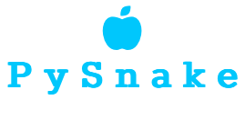
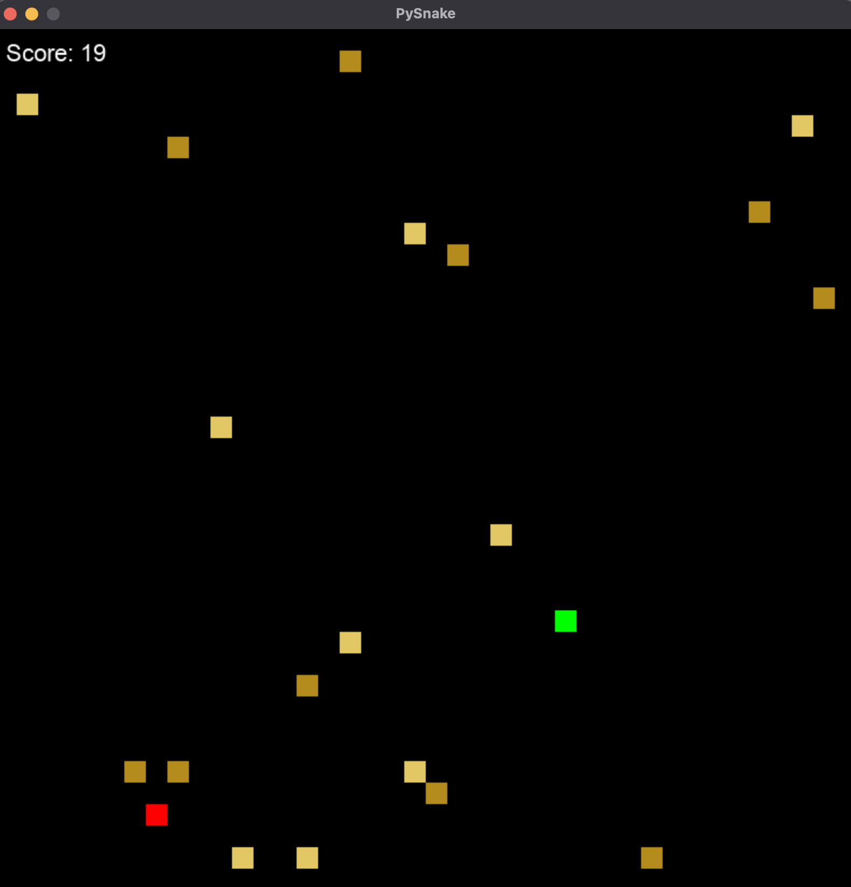

 

`pysnake` is a snake game with a twist. You don't grow in size, but more and more obstacles appear on the screen, making it increasingly harder to catch your food.

This is a little fun side project I started and I quite actually enjoy building and working with.

All of this project is a work-in-progress and subject to change.

Constructive criticism and contributions are well appreciated.

**Table of Contents**
---
+ [Key Features](#key-features)
+ [Usage](#usage)
+ [Installation Options](#installation-options)
+ [How to contribute](#how-to-contribute)
+ [License](#license)
+ [Donations](#donations)

**Key Features**
---
+ try grabbing as much food as you can
+ be careful to not run into an obstacle

Currently only tested on MacOS Monterey.

**Usage**
---

```
Move with W, A, S, D or the arrow keys on your keyboard
```



**Installation Options**
---

1. Clone this repository.
    + `cd ~/your/project/path`
    + `git clone https://github.com/fchehade/pysnake.git`

2. Change directory `cd` to the pysnake root directory.
3. Create a virtual environment and install requirements.txt
    + `python3 -m venv .env`
    + `source .env/bin/activate`
    + `pip install requirements.txt`
4. Afterwards, just run `python3 pysnake/__main__.py`

**How to Contribute**
---

1. Clone repo and create a new branch: `$ git checkout https://github.com/fchehade/pysnake -b name_for_new_branch`.
2. Make changes and test
3. Submit Pull Request with comprehensive description of changes

**License**
---
This project is licensed under [MIT](LICENSE)

**Donations**
---

This is free, open-source software. If you'd like to support the development of future projects, or say thanks for this one, you can donate at [Paypal](https://www.paypal.me/decalift) or [buy me a coffee](https://www.buymeacoffee.com/decalift).

<a href="https://www.paypal.me/decalift"></a>&nbsp; &nbsp; <a href="https://www.buymeacoffee.com/decalift" target="_blank"></a>